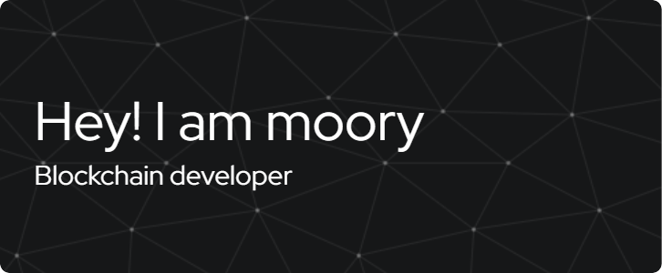

## Hi there  my name is moory👋

<!--
**the-fool-33/the-fool-33** is a ✨ _special_ ✨ repository because its `README.md` (this file) appears on your GitHub profile.

Here are some ideas to get you started:

- 🔭 I’m currently working on ...
- 🌱 I’m currently learning ...
- 👯 I’m looking to collaborate on ...
- 🤔 I’m looking for help with ...
- 💬 Ask me about ...
- 📫 How to reach me: ...
- 😄 Pronouns: ...
- ⚡ Fun fact: ...
-->
 
### About Me 😎
#### 🌱 I’m currently learning **BlockChain**
#### ⚡ Fun fact: **i am human😅**
### Skills ⭐

#### -Languages 👨‍💻
 
#### -FrameWorks & Library 🚀

### Let's play game 🐍

###

### MY stats 📈

 